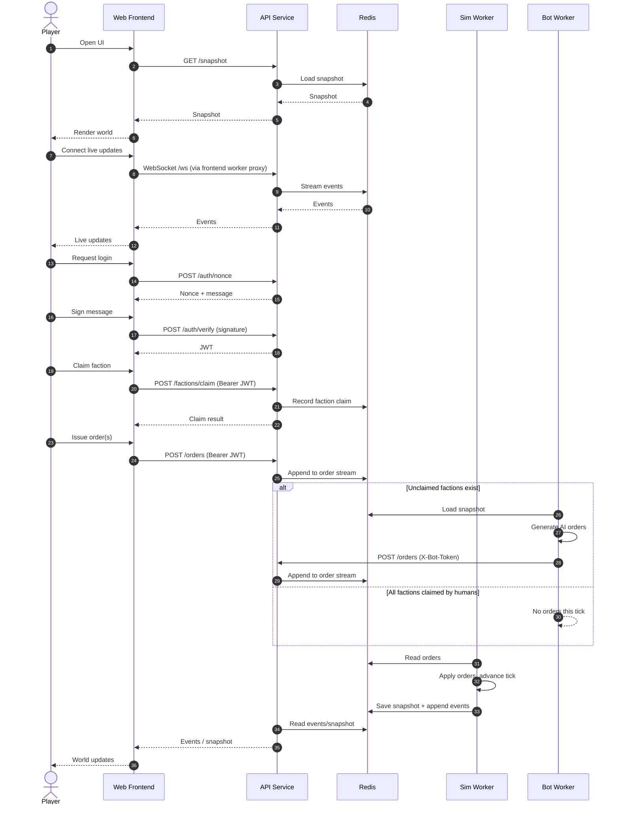
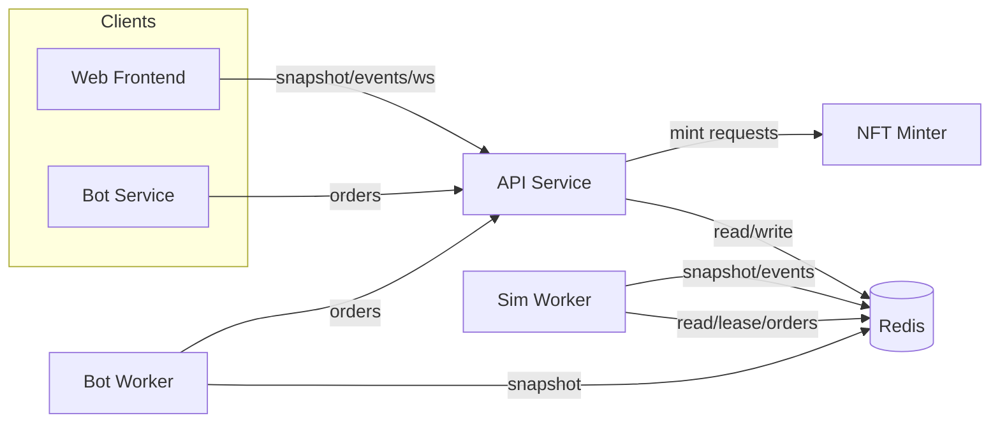
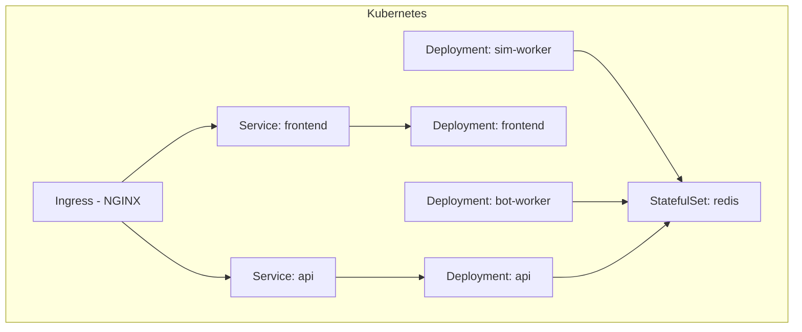
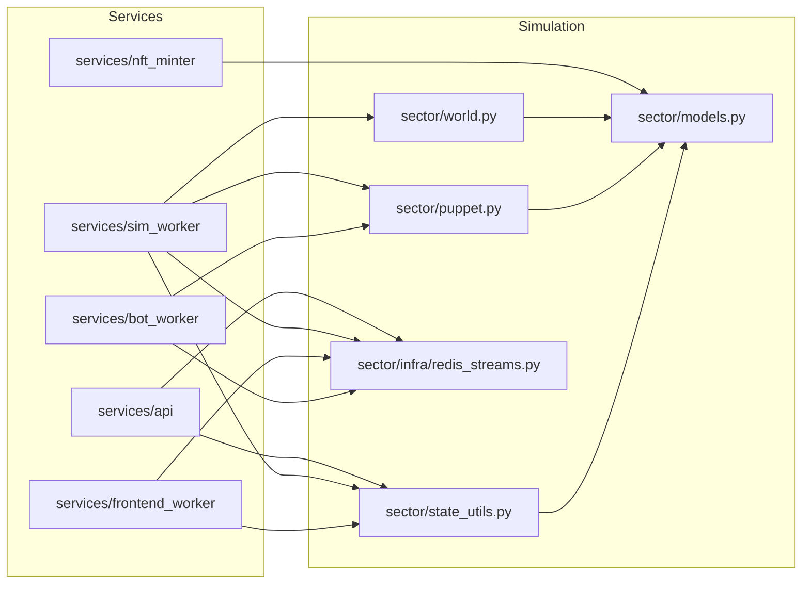

# Sector: 40k‑Inspired Simulation

A playable, Warhammer 40k–inspired sector simulation with real-time updates and bot factions. The stack is Redis-backed and fully stateless at the service layer:
- API service (auth, orders, snapshot, events, admin controls)
- Simulation worker (advances the world and emits snapshots/events)
- Frontend worker (serves the UI and streams updates over WebSocket)
- Bot worker (AI orders for unclaimed factions)
- NFT minter (standalone HTTP service for minting awards)

All long-lived state lives in Redis (streams + snapshot hash).

## Running locally

```bash
# build and start redis, api, sim-worker, bot-worker, and frontend
docker compose up --build
```

API will be on `http://localhost:8000` (health at `/health`, snapshot at `/snapshot`). Frontend is on `http://localhost:9000/`. Redis is exposed on `localhost:6379`.

The NFT minter is not part of docker-compose. It has its own Dockerfile for testing:

```bash
docker build -t sector-nft-minter:local services/nft_minter
docker run --rm -p 9100:9100 sector-nft-minter:local
```

## Deploying on Kubernetes

The `k8s/` directory contains a kustomize base for Redis, API, sim worker, frontend worker, bot worker, and ingress. Deployment can be done end-to-end with the script in `deploy_vps.sh`.

Deploy script usage (VPS):
- Prereqs: root/sudo on the VPS, outbound internet access, and a DNS name pointing to the VPS.
- Required: git repo URL as the first argument.
- Required env vars: `DOMAIN`, `EMAIL`.
- Optional env vars: `KUBECONFIG_PATH`, `REPO_DIR`, `K3S_VERSION`, `IMAGE_NAME`, `IMAGE_TAG`, `STOP_HOST_NGINX`, `TLS_SECRET_NAME`.
- Run:

```bash
DOMAIN=sector.example.com EMAIL=you@example.com ./deploy_vps.sh <git_repo_url>
```

Manual deployment (without the script):
1. Build the application image and push it to a registry your cluster can reach:
   ```bash
   docker build -t <registry>/distributed-app:latest .
   docker push <registry>/distributed-app:latest
   ```
2. Update the image reference via kustomize (either edit `k8s/kustomization.yaml` or run `kustomize edit set image distributed-app=<registry>/distributed-app:latest`).
3. Install the bundled NGINX ingress controller (creates the `ingress-nginx` namespace, RBAC, Deployment, and a `LoadBalancer` Service):
   ```bash
   kubectl apply -f k8s/ingress-nginx/controller.yaml
   # wait for the ingress controller pod to be Ready and note the EXTERNAL-IP on its Service
   kubectl get pods,svc -n ingress-nginx
   ```
   (If your cluster lacks a load balancer, edit the Service type in `k8s/ingress-nginx/controller.yaml` to `NodePort` and expose the ports manually.)
4. Apply the app manifests (includes separate ingress objects for API and frontend; frontend HTTP traffic is served at `/`, and `/ws` is served by the same ingress):
   ```bash
   kubectl apply -k k8s
   ```
5. Add `sector.local` to your hosts file (pointing to `127.0.0.1` on Docker Desktop) and hit `http://sector.local/api/health` or `http://sector.local/`. Without an ingress controller you can still port-forward the ClusterIP services:
   ```bash
   kubectl port-forward svc/api 8000:8000
   kubectl port-forward svc/frontend 9000:9000
   ```
6. Tear everything down with:
   ```bash
   kubectl delete -k k8s
   kubectl delete -f k8s/ingress-nginx/controller.yaml
   ```

## Configuration

- Shared Redis:
  - `REDIS_URL` points services at Redis.
  - `EVENT_STREAM`, `ORDER_STREAM`, `SNAPSHOT_KEY` name the Redis keys/streams.
- API:
  - `PORT`, `JWT_SECRET`, `JWT_TTL_SECONDS`, `AUTH_NONCE_TTL_SECONDS`
  - `BOT_API_TOKEN` (required by bot-worker to post orders)
- Sim worker:
  - `LEASE_TTL_MS`, `ORDER_BLOCK_MS`, `RESET_UNIVERSE_ON_START`
  - `EVENT_STREAM_MAXLEN`, `SNAPSHOT_EVERY`
  - `WAIT_FOR_FRONTEND`, `FRONTEND_HEALTH_URL`
- Bot worker:
  - `BOT_API_URL`, `BOT_API_TOKEN`, `BOT_POLL_INTERVAL`, `BOT_MAX_ORDERS`, `BOT_EVENT_BLOCK_MS`
- Viz:
  - `API_URL`, `PORT`
- NFT minter:
  - `PORT`, `MINTER_API_KEY`

## How it works (stateless loop)

1. Sim worker acquires a Redis lease to ensure only one tick loop runs.
2. Sim worker loads or seeds the world, then consumes orders from the orders stream.
3. Orders are normalized (pathing, fleet selection), applied, and the world advances a tick.
4. Sim worker publishes snapshot + events to Redis (snapshot hash + event stream).
5. API serves snapshot/events and accepts orders. Human orders require auth; bots use `X-Bot-Token`.
6. Frontend worker serves the UI and a `/ws` stream sourced from Redis events.
7. Bot worker polls snapshots, generates AI orders for unclaimed factions, and posts them to the API.

## API endpoints

Base URL: `http://localhost:8000` (via API service). The frontend worker proxies API calls under `/api/*` for the browser.

Auth:
- `POST /auth/nonce` to get a nonce + login message.
- `POST /auth/verify` with signature to get a JWT.
- Pass `Authorization: Bearer <token>` on human-only endpoints.
- Bot orders use `X-Bot-Token: <BOT_API_TOKEN>` and skip human auth.

Endpoints (API service):
- `GET /health`
- `POST /auth/nonce`
- `POST /auth/verify`
- `GET /me`
- `GET /factions`
- `POST /factions/claim`
- `GET /snapshot`
- `GET /events?after=<id>&count=<n>`
- `POST /orders`
- `POST /admin/restart`
- `POST /admin/bots-only`
- `GET /admin/pause`
- `POST /admin/pause`

NFT minter (separate service, default `http://localhost:9100`):
- `GET /health`
- `POST /mint` (optional `Authorization: Bearer <MINTER_API_KEY>`)

## Architecture diagram (human player timeline)



## Architecture diagram



## Architecture diagram (deployment)



## Architecture diagram (code structure)



## Next steps

- Add metrics/observability and resilience (backoff, retries).
