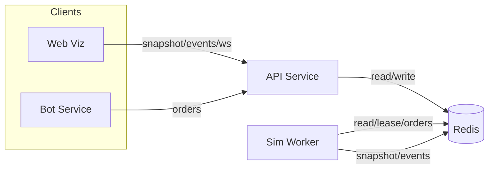
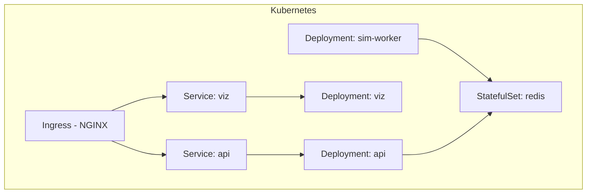
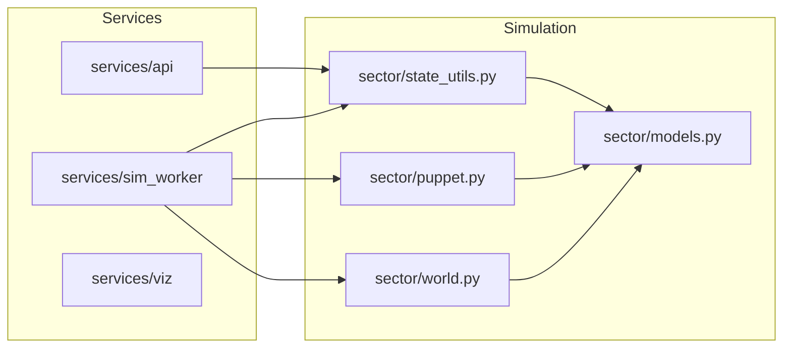

# Stateless Services Skeleton (Redis-backed)

This repo starts a stateless API and a simulation worker that communicate via Redis. The API serves health, snapshot, events, and accepts orders. The worker is stateless: it acquires a lease, loads the latest snapshot, consumes orders, advances a tick, and writes back the snapshot plus events. All state lives in Redis.

## Running locally

```bash
# build and start redis, api, and sim-worker
docker compose up --build
```

API will be on `http://localhost:8000` (health at `/health`, snapshot at `/snapshot`). Redis is exposed on `localhost:6379`.

## Deploying on Kubernetes

The `k8s/` directory contains a simple kustomize base that stands up Redis, API, sim worker, viz worker, and an ingress for routing traffic.

1. Build the application image and push it to a registry your cluster can reach:
   ```bash
   docker build -t <registry>/distributed-app:latest .
   docker push <registry>/distributed-app:latest
   ```
2. Update the image reference via kustomize (either edit `k8s/kustomization.yaml` or run `kustomize edit set image distributed-app=<registry>/distributed-app:latest`).
3. Install the bundled NGINX ingress controller (creates the `ingress-nginx` namespace, RBAC, Deployment, and a `LoadBalancer` Service):
   ```bash
   kubectl apply -f k8s/ingress-nginx/controller.yaml
   # wait for the ingress controller pod to be Ready and note the EXTERNAL-IP on its Service
   kubectl get pods,svc -n ingress-nginx
   ```
   (If your cluster lacks a load balancer, edit the Service type in `k8s/ingress-nginx/controller.yaml` to `NodePort` and expose the ports manually.)
4. Apply the app manifests (includes separate ingress objects for API and viz; viz HTTP traffic is served at `/`, and `/ws` is served by the same ingress):
   ```bash
   kubectl apply -k k8s
   ```
5. Add `sector.local` to your hosts file (pointing to `127.0.0.1` on Docker Desktop) and hit `http://sector.local/api/health` or `http://sector.local/`. Without an ingress controller you can still port-forward the ClusterIP services:
   ```bash
   kubectl port-forward svc/api 8000:8000
   kubectl port-forward svc/viz 9000:9000
   ```
6. Tear everything down with:
   ```bash
   kubectl delete -k k8s
   kubectl delete -f k8s/ingress-nginx/controller.yaml
   ```

## Configuration

- `REDIS_URL` (default `redis://redis:6379/0` in docker-compose) points services at Redis.
- `SIM_ID` selects the simulation namespace (default `default`).
- `TICK_DELAY` controls worker tick speed in seconds (default `0.5`).
- `LEASE_TTL_MS` sets the lease TTL in ms (default `5000`).
- `WORKER_ID` identifies the worker for lease ownership (defaults to hostname).
- Bot service:
  - `BOT_FACTION` sets which faction the bot plays (default `BotFaction`).
  - `BOT_POLL_INTERVAL` controls how often the bot polls snapshots (default `1.0`).
  - `BOT_MAX_ORDERS` caps orders per tick from the bot (default `3`).

## How it works (stateless loop)

1. Worker acquires a Redis lease (`sim:{id}:lease`) to ensure only one tick loop runs.
2. Loads the latest snapshot (`sim:{id}:snapshot`) or seeds one.
3. Reads pending orders from `sim:{id}:orders` after the last processed id.
4. Applies orders, advances one tick (placeholder logic), emits events with ms timestamps.
5. Saves the new snapshot and events with optimistic concurrency (WATCH/MULTI).
6. Renews the lease; if lost, stops mutating.
7. Repeat each `TICK_DELAY`.

API reads `snapshot` and `events`, and appends new `orders`; it holds no state. Orders are validated via a discriminated Pydantic schema (`set_owner`, `add_fleet`, `note`).
A bot service polls snapshots and emits simple orders (claim neutrals, ensure garrisons) for its configured faction.

## Architecture diagram



## Architecture diagram (deployment)



## Architecture diagram (code structure)



## Next steps

- Replace the placeholder state/advance logic with the real simulation.
- Expand event schema and order validation (Pydantic models in the API).
- Add metrics/observability and resilience (backoff, retries).
